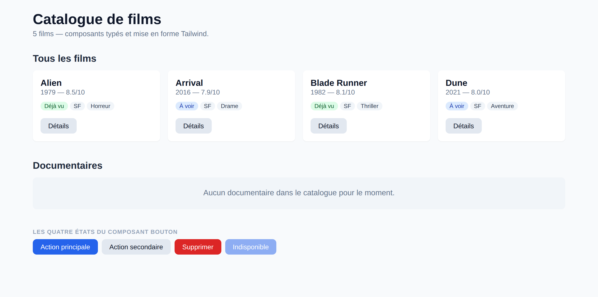
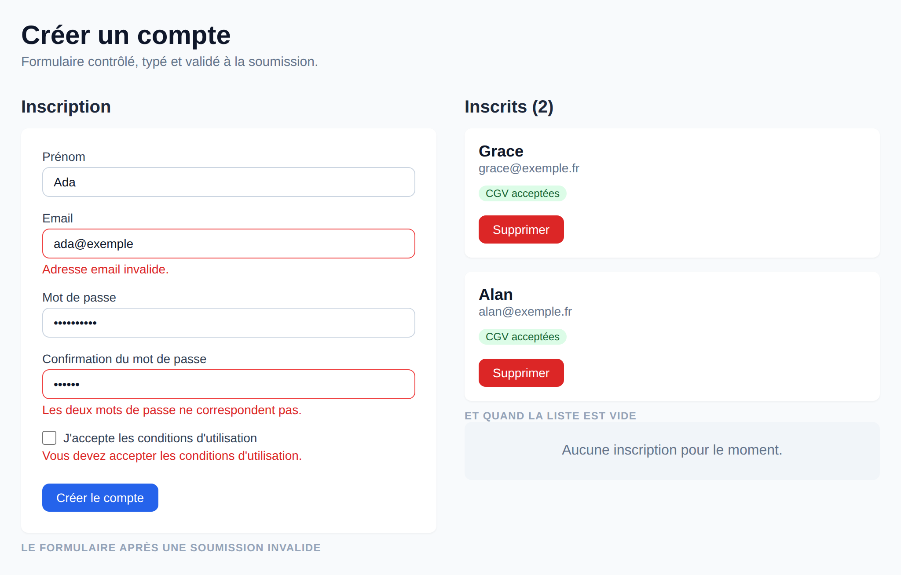

# TP2 — Un mini design system typé

**Séance 2 · en binôme · rendu sur dépôt Git**

## Objectif

Reprendre le projet du TP1 et le transformer en une véritable interface : trois composants réutilisables et typés, une liste de films affichée en grille responsive, le tout mis en forme avec Tailwind CSS.

## L'écran à obtenir



Quatre composants seulement, réutilisés partout : une **Carte** par film, des **Badges** pour le statut et les genres, un **Bouton** dans le pied de chaque carte, le tout assemblé par **ListeFilms**. La zone grise en bas est ce que `ListeFilms` affiche quand la liste est vide.

Les couleurs et les espacements exacts sont libres — c'est la structure qui compte.

## Point de départ

Votre projet du TP1, avec `src/lib/utils.ts` : l'interface `Film`, le type `StatutFilm`, les fonctions `trierPar`, `filtrerParGenre` et la constante `FILMS`.

## Ce qui vous est fourni

- `utils.ts` — une version **simplifiée** du module du TP1, réduite à ce dont le TP2 a besoin.

> **Vous avez terminé le TP1 ?** Gardez votre fichier : il fait déjà tout cela, et davantage.
>
> **Vous n'avez pas terminé ?** Placez ce `utils.ts` dans `src/lib/` et démarrez avec. Ce n'est pas le corrigé du TP1 : il ne contient ni les types utilitaires, ni le contrôle d'exhaustivité, ni les fonctions que vous deviez écrire. Vous êtes débloqués pour aujourd'hui, mais le TP1 reste à finir.

## Consignes

**1. Ajouter Tailwind CSS au projet**

```bash
npm install tailwindcss @tailwindcss/vite
```

Ajouter le plugin dans `vite.config.ts`, puis remplacer le contenu de `src/index.css` par `@import "tailwindcss";`. Vérifier qu'une classe s'applique avant d'aller plus loin — par exemple `className="text-red-500"` sur un titre.

**2. `src/composants/Bouton.tsx`**

Le contrat à respecter :

```ts
export type VarianteBouton = "primaire" | "secondaire" | "danger";

export interface BoutonProps {
  libelle: string;
  variante?: VarianteBouton;   // "primaire" par défaut
  desactive?: boolean;         // false par défaut
  onClick?: () => void;
}
```

Il doit afficher un `<button>` contenant `libelle`, désactivé quand `desactive` vaut `true`, et dont les classes Tailwind changent selon la variante.

Les classes de chaque variante sont rangées dans un objet `Record<VarianteBouton, string>` — pas dans une suite de `if`. Le choix des couleurs est libre, tant que les trois variantes se distinguent et que le focus reste visible au clavier.

```tsx
<Bouton libelle="Valider" />
<Bouton libelle="Supprimer" variante="danger" onClick={supprimer} />
<Bouton libelle="Indisponible" desactive />
```


Anatomie :

```
┌──────────────────────────┐
│      libelle             │  ← le texte reçu en prop
└──────────────────────────┘
   ↑ fond, texte et survol donnés par « variante »
     opacité réduite et curseur barré si « desactive »
```

**3. `src/composants/Carte.tsx`**

```ts
export interface CarteProps {
  titre: string;
  sousTitre?: string;
  children: ReactNode;
  actions?: ReactNode;   // pied de carte, optionnel
}
```

Il doit afficher un bloc sur fond blanc, avec coins arrondis et ombre légère, contenant dans l'ordre :

1. le `titre`, en gras ;
2. le `sousTitre` en dessous, plus petit et plus clair — **uniquement s'il est fourni** ;
3. le contenu `children`, quel qu'il soit ;
4. `actions` en pied de carte — **uniquement si fourni**.

La carte ne décide jamais de son contenu : elle l'accueille.

```tsx
<Carte titre="Alien" sousTitre="1979 — 8.5/10" actions={<Bouton libelle="Détails" />}>
  <p>Un équipage découvre un signal…</p>
</Carte>
```


Anatomie :

```
┌───────────────────────────────────┐
│ titre                             │  ← gras
│ sousTitre                         │  ← plus petit et plus clair, si fourni
│                                   │
│ children                          │  ← contenu libre, décidé par l'appelant
│                                   │
│ actions                           │  ← pied de carte, si fourni
└───────────────────────────────────┘
   fond blanc · coins arrondis · ombre légère
```

**4. `src/composants/Badge.tsx`**

```ts
export type TonBadge = "neutre" | "succes" | "info" | "attention";

export interface BadgeProps {
  texte: string;
  ton?: TonBadge;   // "neutre" par défaut
}
```

Il doit afficher un petit `<span>` arrondi, en texte réduit, avec une couleur de fond par ton. Même principe que le bouton : un objet indexé par l'union.

```tsx
<Badge texte="SF" />
<Badge texte="Déjà vu" ton="succes" />
```


Anatomie :

```
╭───────────╮
│  texte    │   ← petite pastille arrondie
╰───────────╯
   couleur de fond donnée par « ton »
```

**5. `src/composants/ListeFilms.tsx`**

```ts
export interface ListeFilmsProps {
  films: Film[];
  messageVide?: string;
  onSelection?: (film: Film) => void;
}
```

C'est le composant qui assemble les trois autres. Il doit afficher une `<ul>` en grille, avec une `<li>` par film portant sa `key`, et dans chaque `<li>` une `Carte` où :

- le titre de la carte est le titre du film ;
- le sous-titre est l'année et la note, par exemple `1979 — 8.5/10` ;
- le contenu est un `Badge` pour le statut, suivi d'un `Badge` par genre ;
- si `onSelection` est fourni, un `Bouton` « Détails » est placé dans `actions`.

Pour le badge de statut, utilisez cette correspondance — elle vous évitera d'inventer :

| statut | libellé affiché | ton |
|---|---|---|
| `vu` | Déjà vu | `succes` |
| `a_voir` | À voir | `info` |
| `abandonne` | Abandonné | `neutre` |

Rangez-la, elle aussi, dans un objet indexé par `StatutFilm`.


Anatomie :

```
ListeFilms
│
├─ films vide ?  →  message unique, et on s'arrête là
│
└─ sinon : <ul> en grille
     └─ <li key={film.id}>
          └─ Carte  titre = film.titre
                    sousTitre = "1979 — 8.5/10"
                    children  = Badge(statut) + un Badge par genre
                    actions   = Bouton « Détails »  (si onSelection)
```

**6. Traiter le cas de la liste vide**

Si le tableau reçu est vide, afficher un message dédié plutôt qu'une grille vide. Traitez ce cas **en premier**, par un retour anticipé.

**7. Assembler dans `App.tsx`**

Réutilisez `trierPar` et `filtrerParGenre` du TP1 pour afficher plusieurs sections : tous les films triés par titre, puis un genre en particulier. Prévoyez une section dont le filtre ne renvoie rien, pour démontrer le cas vide.

**8. Grille responsive**

1 colonne sur mobile, 2 à partir de `md`, 4 à partir de `lg`. Aucune feuille de style personnalisée : tout passe par des classes Tailwind.

## Ce que vous ne devez pas encore utiliser

Pas de `useState`, pas de `useEffect` : ils arrivent en séance 3 et 4. Cette interface est entièrement statique, et c'est volontaire — tout ce qui s'affiche découle des données et des props.

## Points de vigilance

- **`variante = "primaire"` en valeur par défaut**, plutôt que `variante?: string`. L'éditeur proposera alors les trois valeurs possibles, et refusera les fautes de frappe.
- **`Record<VarianteBouton, string>`** pour la table des styles : si vous ajoutez une variante à l'union sans l'ajouter à la table, le compilateur vous le dit.
- **`{films.length === 0 ? … }`** ou un retour anticipé, jamais `{films.length && …}` : avec un tableau vide, le `0` s'afficherait à l'écran.
- **`import type { ReactNode } from "react"`** : le mot-clé `type` indique qu'on n'importe qu'un type, effacé au build.
- **Les classes Tailwind sont mobile-first** : le style sans préfixe s'applique partout, `md:` et `lg:` ajoutent les adaptations pour les écrans plus larges.

## Critères de réussite

- [ ] Chaque composant exporte son interface de props
- [ ] `npx tsc --noEmit` ne renvoie aucune erreur, et il n'y a aucun `any`
- [ ] `Carte` accepte du contenu libre via `children`
- [ ] La variante du bouton est une union littérale, pas une chaîne libre
- [ ] Les `key` sont des identifiants stables, pas des index
- [ ] Le cas de la liste vide est traité avec un message dédié
- [ ] La grille s'adapte réellement à trois largeurs d'écran
- [ ] Les états `hover` et `focus` sont visibles, y compris au clavier
- [ ] Aucune feuille CSS personnalisée


# TP3 — Formulaire d'inscription validé

**Séance 3 · en binôme · rendu sur dépôt Git**

## Objectif

Construire un formulaire contrôlé entièrement typé, avec validation à la soumission, affichage d'erreurs accessible, et un récapitulatif des inscriptions affiché en dessous.

## L'écran à obtenir



À gauche, le formulaire tel qu'il se présente **après une soumission invalide** : chaque champ fautif porte une bordure rouge et son message juste en dessous. À droite, la liste des inscriptions déjà validées, une `Carte` par inscrit — et ce qu'affiche cette liste quand elle est vide.

Les couleurs et les espacements exacts sont libres — c'est le comportement qui compte.

## Point de départ

Votre projet du TP2, avec ses composants `Bouton`, `Carte` et `Badge`.

## Ce qui vous est fourni

- `composants/` — les trois composants du TP2, dans leur version corrigée.

> **Vous avez terminé le TP2 ?** Gardez vos composants, ils font l'affaire.
>
> **Vous n'avez pas terminé ?** Copiez ceux-ci dans `src/composants/` et démarrez avec. Ils ne dispensent pas de finir le TP2.

Rien d'autre n'est fourni : le formulaire, la validation et la liste sont entièrement à écrire.

## Consignes

**1. Rendre `Bouton` capable de soumettre**

Le `Bouton` du TP2 est figé en `type="button"` : cliqué dans un formulaire, il ne déclenche rien. Ajoutez-lui une prop `type`, typée par une union — pas par `string` :

```ts
export type TypeBouton = "button" | "submit";
// dans BoutonProps :
type?: TypeBouton;   // "button" par défaut
```

C'est la seule modification à apporter aux composants du TP2. `Carte` et `Badge` sont réutilisés tels quels.

**2. `src/lib/inscription.ts` — les types et la validation**

Ce fichier ne contient aucun JSX. Il décrit les données du formulaire et les règles qui s'y appliquent :

```ts
export interface Inscription {
  prenom: string;
  email: string;
  motDePasse: string;
  confirmation: string;
  cgv: boolean;
}

export const valeursInitiales: Inscription = { /* tous les champs vides */ };

export type Erreurs = Partial<Record<keyof Inscription, string>>;

export function valider(donnees: Inscription): Erreurs { /* … */ }
```

`Erreurs` doit être **dérivé** de `Inscription` par `keyof`, jamais réécrit à la main. Ainsi, si vous ajoutez un champ demain, le type des erreurs le connaît immédiatement, et une faute de frappe (`erreurs.emial`) devient une erreur de compilation.

Les règles à implémenter :

| Champ | Règle |
|---|---|
| `prenom` | au moins 2 caractères, espaces de bord ignorés |
| `email` | format `xxx@yyy.zz` |
| `motDePasse` | 8 caractères minimum |
| `confirmation` | identique à `motDePasse` |
| `cgv` | doit valoir `true` |

`valider` renvoie un objet **vide** quand tout est correct. C'est ce qui permet d'écrire `Object.keys(erreurs).length === 0` pour décider si on continue.

**3. `src/composants/ChampTexte.tsx` — un champ contrôlé réutilisable**

Le contrat :

```ts
export interface ChampTexteProps {
  nom: string;                                     // sert d'id ET de name
  label: string;
  valeur: string;
  onChange: (e: ChangeEvent<HTMLInputElement>) => void;
  type?: "text" | "email" | "password";            // "text" par défaut
  erreur?: string;
  placeholder?: string;
}
```

Sans ce composant, les lignes d'accessibilité seraient à recopier quatre fois. Il regroupe le label, le champ et le message d'erreur.

Anatomie :

```
┌───────────────────────────────────────────┐
│ label                                     │  ← <label htmlFor={nom}>
│ ┌───────────────────────────────────────┐ │
│ │ valeur                                │ │  ← <input id={nom} name={nom}
│ └───────────────────────────────────────┘ │       value={valeur} onChange={…} />
│ erreur                                    │  ← <p id={nom + "-erreur"}>, si fourni
└───────────────────────────────────────────┘
   bordure rouge si « erreur », grise sinon
   aria-invalid={!!erreur}
   aria-describedby = l'id du <p>, ou undefined s'il n'y a pas d'erreur
```

**4. `src/composants/FormulaireInscription.tsx`**

C'est le composant qui porte l'état. Trois `useState` seulement :

```ts
const [donnees, setDonnees] = useState<Inscription>(valeursInitiales);
const [erreurs, setErreurs] = useState<Erreurs>({});
const [envoiEnCours, setEnvoiEnCours] = useState(false);
```

Un **seul** objet pour les cinq champs, donc un **seul** handler de saisie, qui s'appuie sur l'attribut `name` :

```ts
const gererSaisie = (e: ChangeEvent<HTMLInputElement>) => {
  const { name, value } = e.target;
  setDonnees((d) => ({ ...d, [name]: value }));   // clé dynamique
};
```

⚠️ **La case à cocher est le piège de ce TP.** Un `<input type="checkbox">` ne transporte pas sa donnée dans `value` mais dans `checked`. Votre handler doit distinguer les deux :

```ts
const { name, value, type, checked } = e.target;
const valeur = type === "checkbox" ? checked : value;
```

Et côté JSX, une case cochée se pilote par `checked={donnees.cgv}`, jamais par `value`.

La soumission se branche sur le `<form>`, pas sur le bouton :

```ts
const gererEnvoi = (e: FormEvent<HTMLFormElement>) => {
  e.preventDefault();
  const trouvees = valider(donnees);
  setErreurs(trouvees);
  if (Object.keys(trouvees).length > 0) return;
  // … c'est valide : on prévient le parent, on remet le formulaire à zéro
};
```

Le formulaire **ne stocke pas** la liste des inscriptions : il reçoit une prop `onInscription: (donnees: Inscription) => void` et l'appelle. Qui détient l'état détient la vérité — et ici, c'est `App`.

Ajoutez `noValidate` sur le `<form>` : sans cela, le navigateur affiche ses propres bulles de validation par-dessus les vôtres.

**5. L'état de soumission**

Pendant l'envoi, le bouton est désactivé et son libellé change en « Envoi en cours… ». Il n'y a pas encore de serveur : simulez le délai avec un `window.setTimeout` de quelques centaines de millisecondes, puis remettez `envoiEnCours` à `false`. Le vrai appel réseau arrive en séance 4.

**6. `src/composants/ListeInscriptions.tsx`**

```ts
export interface ListeInscriptionsProps {
  inscriptions: InscriptionEnregistree[];
  onSuppression?: (id: number) => void;
}
```

Une `Carte` par inscrit : le prénom en titre, l'email en sous-titre, un `Badge` dans le contenu, et un `Bouton` « Supprimer » dans `actions` si `onSuppression` est fourni. Cas vide traité **en premier**, par un retour anticipé, comme au TP2.

Anatomie :

```
ListeInscriptions
│
├─ liste vide ?  →  message unique, et on s'arrête là
│
└─ sinon : <ul> en grille
     └─ <li key={inscription.id}>
          └─ Carte  titre     = prenom
                    sousTitre = email
                    children  = Badge « CGV acceptées »
                    actions   = Bouton « Supprimer »  (si onSuppression)
```

**7. `src/App.tsx` — assembler**

`App` détient la liste :

```ts
const [inscriptions, setInscriptions] = useState<InscriptionEnregistree[]>([]);
```

Le type stocké n'est **pas** `Inscription` : on ne conserve jamais un mot de passe. Dérivez-le du type existant plutôt que d'en réécrire un :

```ts
export type InscriptionEnregistree =
  Omit<Inscription, "motDePasse" | "confirmation"> & { id: number };
```

Ajout et suppression se font **sans muter** :

```ts
setInscriptions((liste) => [nouvelle, ...liste]);              // ajout
setInscriptions((liste) => liste.filter((i) => i.id !== id));  // suppression
```

## Ce que vous ne devez pas encore utiliser

Pas de `useEffect`, pas de `fetch`, pas de bibliothèque de formulaires (React Hook Form, Formik, Zod…). Tout s'écrit à la main : c'est la seule façon de comprendre ce que ces bibliothèques font à votre place.

## Points de vigilance

- **`useState([])` donne `never[]`** : dès que la valeur initiale est `[]`, `null` ou `undefined`, il faut annoter — `useState<InscriptionEnregistree[]>([])`.
- **Jamais de mutation** : ni `push`, ni `inscriptions[0].prenom = …`. React compare les références : muter le tableau existant ne déclenche aucun rendu.
- **Mise à jour fonctionnelle** dès que le nouvel état dépend du précédent : `setDonnees((d) => ({ ...d, … }))`, pas `setDonnees({ ...donnees, … })`.
- **`onSubmit` sur le `<form>`**, jamais `onClick` sur le bouton : la touche Entrée doit soumettre le formulaire.
- **`value` sans `onChange`** rend le champ en lecture seule et affiche un avertissement dans la console. Les deux vont toujours ensemble.
- **`aria-describedby={erreur ? id : undefined}`** : passer une chaîne vide laisserait l'attribut en place et casserait la lecture d'écran.
- **`key={inscription.id}`**, jamais l'index du tableau — sinon la suppression d'un élément décale tous les autres.

## Critères de réussite

- [ ] Tous les champs sont contrôlés (`value` + `onChange`)
- [ ] Un seul objet d'état pour le formulaire, pas un `useState` par champ
- [ ] Le type `Erreurs` est dérivé de `Inscription` par `keyof`, pas réécrit
- [ ] `onSubmit` est sur le `<form>` : la touche Entrée fonctionne
- [ ] Chaque champ a un `<label htmlFor>` relié à l'`id` du champ
- [ ] Les erreurs sont annoncées par `aria-invalid` et `aria-describedby`
- [ ] La case à cocher est pilotée par `checked`, et le handler la distingue
- [ ] Le bouton est désactivé pendant l'envoi, avec un libellé d'attente
- [ ] Aucune mutation d'état (pas de `push`, pas d'affectation directe)
- [ ] Les mots de passe ne sont pas conservés dans la liste
- [ ] `npx tsc --noEmit` ne renvoie aucune erreur, et il n'y a aucun `any`


# TP4 — Recherche de films en React + TypeScript

**Séance 4 · en binôme · rendu sur dépôt Git**

## Objectif

Reprendre le TP de recherche OMDB fait en JavaScript vanilla et le réécrire en React + TypeScript, avec les quatre états d'affichage et une requête annulable.

## L'écran à obtenir


Un champ de recherche, et en dessous **un seul de ces quatre affichages à la fois** : l'invitation quand le champ est vide, « Chargement… » pendant la requête, le message d'erreur si elle échoue, ou la grille de résultats. Le cinquième cas — « aucun film ne correspond » — est celui qu'on oublie, et c'est le premier que voit un utilisateur qui tape n'importe quoi.

Les couleurs et les espacements sont libres. Ce qui compte, c'est que les quatre états soient **réellement atteignables** et que je puisse les provoquer devant vous.

## Point de départ

Votre projet du TP2 ou du TP3, avec ses composants `Bouton`, `Carte` et `Badge`.

## Ce qui vous est fourni

- `composants/` — les trois composants du TP2, dans leur version corrigée, si vous ne les avez pas.
- `env.local.exemple` — le fichier de configuration à renommer et à compléter.

## Consignes

**1. La clé d'API**

Créez un compte gratuit sur [omdbapi.com](https://www.omdbapi.com/apikey.aspx) : la clé arrive par email et le quota gratuit est de 1 000 requêtes par jour, largement suffisant.

Renommez `env.local.exemple` en **`.env.local`** à la racine du projet, à côté de `package.json`, et collez-y votre clé :

```
VITE_OMDB_KEY=votre_cle_ici
```

⚠️ **`.env.local`, pas `.env`.** Le `.gitignore` du template Vite ignore `*.local` — il n'ignore **pas** `.env`. Une clé placée dans `.env` part sur le dépôt au premier commit, et le rendu de ce TP est justement un dépôt Git.

Et sachez ce que ça protège exactement : toute variable préfixée `VITE_` est **inlinée dans le bundle au build**. `.env.local` empêche la clé de partir sur GitHub ; il ne l'empêche pas d'être lisible dans les outils de développement du navigateur. Pour une vraie application, la clé reste sur un serveur intermédiaire — c'est le point vu en cours.

Redémarrez `npm run dev` après avoir créé le fichier : Vite ne relit pas les variables d'environnement à chaud.

**2. `src/lib/omdb.ts` — les types et l'URL**

Faites une vraie recherche dans votre navigateur pour voir la forme exacte de la réponse :

```
https://www.omdbapi.com/?apikey=VOTRE_CLE&s=batman
```

Puis déclarez les deux interfaces d'après ce que vous voyez :

```ts
export interface FilmOmdb {
  imdbID: string;
  Title: string;
  Year: string;
  Type: string;      // "movie" | "series" | "game" — l'API n'est pas plus précise
  Poster: string;    // une URL, ou la chaîne "N/A"
}

export interface ReponseRecherche {
  Search?: FilmOmdb[];       // absent quand la recherche échoue
  totalResults?: string;
  Response: "True" | "False";
  Error?: string;
}
```

**Pourquoi `FilmOmdb` et pas `Film` ?** Parce que `src/lib/utils.ts` exporte déjà un `Film` depuis le TP1. Deux types du même nom dans un même projet finissent toujours par être importés l'un pour l'autre.

Écrivez aussi la fonction qui construit l'URL — et **encodez le terme** (`encodeURIComponent`), sinon un espace ou un accent casse la requête.

Pour que `import.meta.env.VITE_OMDB_KEY` soit typé plutôt qu'`any`, complétez `src/vite-env.d.ts` :

```ts
interface ImportMetaEnv {
  readonly VITE_OMDB_KEY: string;
}
interface ImportMeta {
  readonly env: ImportMetaEnv;
}
```

**3. La première version : `fetch` dans un `useEffect`**

Écrivez-la **à la main dans le composant**. Pas de hook personnalisé pour l'instant : le but est que vous écriviez une fois ce que vous factoriserez ensuite.

```ts
const [films, setFilms] = useState<FilmOmdb[]>([]);
const [chargement, setChargement] = useState(false);
const [erreur, setErreur] = useState<string | null>(null);
```

Trois pièges à traiter explicitement :

| Piège | Ce qu'il faut écrire |
|---|---|
| `fetch` ne rejette pas sur un 404 ou un 500 | `if (!r.ok) throw new Error(...)` |
| OMDB répond **200** avec `Response: "False"` | tester le contrat de l'API, pas seulement le code HTTP |
| en mode strict, le `catch` reçoit `unknown` | `e instanceof Error ? e.message : "Erreur inconnue"` |

Et rappelez-vous que la fonction passée à `useEffect` **ne peut pas être `async`** : on déclare la fonction asynchrone à l'intérieur, puis on l'appelle.

**4. Les quatre états**

Traitez-les dans cet ordre, par retours anticipés :

```
champ vide     → « Tapez un titre pour lancer la recherche. »
chargement     → « Chargement… »
erreur         → le message, en rouge
aucun résultat → « Aucun film ne correspond à « … ». »
sinon          → la grille
```

Anatomie :

```
RechercheFilms
│
├─ <input>  value={terme}  onChange={…}      ← champ contrôlé, comme au TP3
│
└─ un seul affichage à la fois
     ├─ !terme        → invitation
     ├─ chargement    → « Chargement… »
     ├─ erreur        → message rouge
     ├─ films vide    → « aucun film ne correspond »
     └─ sinon         → <ul> en grille
                          └─ <li key={film.imdbID}>
                               └─ CarteFilm  film={film}
```

**5. `AbortController`**

Ajoutez l'annulation de la requête précédente dans le nettoyage de l'effet :

```ts
const controleur = new AbortController();
// … fetch(url, { signal: controleur.signal })
return () => controleur.abort();
```

Deux raisons, et la deuxième est la vraie :

- en développement, `StrictMode` monte les composants deux fois : vous verrez **deux requêtes** dans l'onglet Réseau. C'est normal ;
- surtout, sans annulation, l'utilisateur tape « bat » puis « batman », la réponse de « bat » arrive en dernier et **écrase le bon résultat**.

L'`AbortError` qui remonte dans le `catch` n'est pas une erreur à afficher : c'est vous qui l'avez provoquée. Sortez du `catch` sans rien faire.

**6. `src/composants/CarteFilm.tsx`**

Un **adaptateur** : il traduit un film OMDB en props pour la `Carte` du TP2, qu'il ne modifie pas.

```ts
export interface CarteFilmProps {
  film: FilmOmdb;
}
```

Anatomie :

```
CarteFilm  film={film}
   │
   └─ Carte  titre     = film.Title
             sousTitre = film.Year
             children  = l'affiche + un Badge pour le type
                          ├─ Poster === "N/A" ? un bloc gris « Pas d'affiche »
                          └─ sinon : 
```

C'est le moment où le TP2 est rentabilisé : la `Carte` a été écrite sans rien savoir des films, donc elle accueille aussi bien un catalogue local qu'une réponse d'API. **Ne la modifiez pas** — si vous en avez envie, c'est que l'adaptateur n'est pas au bon endroit.

Le `Type` renvoyé par l'API vaut `movie`, `series` ou `game` : traduisez-le avec un objet indexé, comme les variantes du bouton au TP2.

**7. Bonus — le hook `useFetch<T>`**

Extrayez toute la logique de chargement dans `src/hooks/useFetch.ts` :

```ts
export function useFetch<T>(url: string | null): {
  donnees: T | null;
  chargement: boolean;
  erreur: string | null;
};
```

Deux points qui font tout l'intérêt de l'exercice :

- **`url: string | null`** — à `null`, le hook ne lance rien. C'est plus lisible qu'un `if` dans l'effet, et ça évite une dépendance instable.
- **le hook ne connaît pas OMDB.** Il gère le transport : HTTP, annulation, erreurs réseau. Le contrat métier de l'API (`Response === "False"`) reste la responsabilité du composant. Si le mot « film » apparaît dans `useFetch.ts`, c'est raté.

Comparez ensuite vos deux composants : même comportement, moitié moins de lignes. C'est l'argument.

**8. Bonus — la recherche différée (debounce)**

Ne lancez la requête que 400 ms après la dernière frappe. Tout tient dans un effet et son nettoyage :

```ts
useEffect(() => {
  const id = window.setTimeout(() => setTermeDiffere(terme), 400);
  return () => window.clearTimeout(id);
}, [terme]);
```

À chaque frappe, le nettoyage annule le minuteur précédent. C'est le même mécanisme que l'`AbortController`, appliqué au temps plutôt qu'au réseau.

## Points de vigilance

- **Pas de tableau de dépendances = boucle infinie.** L'effet modifie l'état, l'état déclenche un rendu, le rendu rejoue l'effet. Le réflexe de diagnostic : onglet **Réseau** des outils de développement — des requêtes qui défilent sans fin, c'est un tableau manquant ou instable.
- **Une dépendance doit être une valeur primitive.** Un objet ou un tableau se recrée à chaque rendu : passez `terme`, pas `{ terme }`.
- **`useEffect(async () => …)` ne compile pas.** Une fonction `async` renvoie une Promise, et React attend une fonction de nettoyage ou rien.
- **`r.json()` renvoie `any`.** L'annotation `const d: ReponseRecherche = await r.json()` est une promesse que vous faites au compilateur, pas une vérification. Si l'API change, TypeScript ne s'en apercevra pas.
- **`key={film.imdbID}`**, jamais l'index du tableau.
- **`Poster` peut valoir la chaîne `"N/A"`** : un `` dessus affiche une icône cassée. Testez avant.
- **Redémarrez `npm run dev`** après avoir créé `.env.local`.

## Critères de réussite

- [ ] La clé d'API n'est pas commitée : `.env.local`, jamais dans le dépôt
- [ ] Les quatre états sont visibles et je peux les provoquer devant vous
- [ ] `CarteFilm` réutilise la `Carte` du TP2 **sans la modifier**
- [ ] Aucune boucle infinie : l'onglet Réseau est propre
- [ ] Le code d'erreur HTTP est vérifié (`r.ok`) avant de lire le corps
- [ ] Le nettoyage de l'effet est présent, et l'`AbortError` n'est pas affichée
- [ ] Le cas « pas d'affiche » est traité
- [ ] `npx tsc --noEmit` ne renvoie aucune erreur, et il n'y a aucun `any`